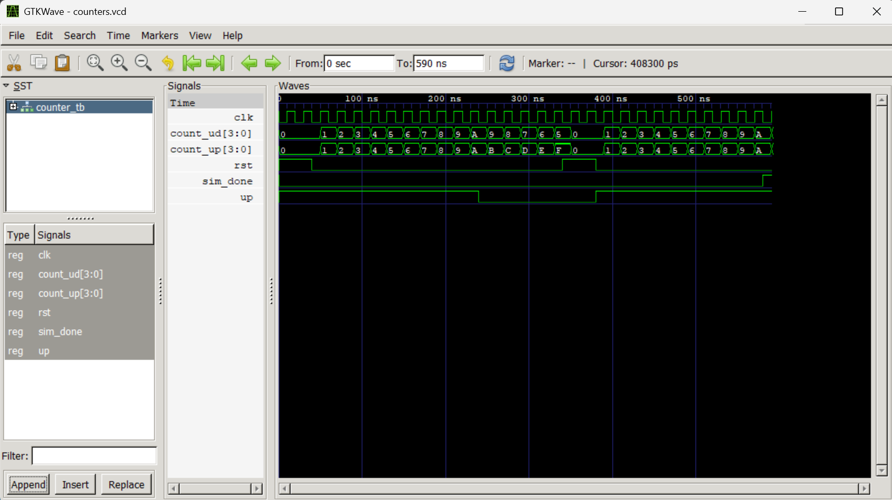

# Lab 8: VHDL Code for Sequential Circuits (Counters)

## Course Information

* **Course:** Computer Architecture (CMP 262)
* **Program:** Bachelor of Computer Engineering
* **Semester:** Fourth Semester
* **College:** Cosmos College of Management and Technology
* **Department:** Information and Communication Technology

---

# Objective

* To design and simulate a **4-bit Synchronous Up Counter** in VHDL.
* To design and simulate a **4-bit Synchronous Up/Down Counter** in VHDL.
* To understand the implementation of sequential circuits using flip-flops.
* To verify the counter designs using **GHDL** and **GTKWave**.

---

# Introduction

## Counter

A counter is a **sequential logic circuit** that progresses through a predetermined sequence of binary states in response to clock pulses. Unlike combinational circuits, counters use memory elements (flip-flops) to store their current state.

Counters are widely used in:

* Digital clocks
* Frequency division
* Event counting
* Timers
* Sequence generation
* Digital control systems

In this laboratory, two types of synchronous counters are implemented:

* **4-bit Synchronous Up Counter**
* **4-bit Synchronous Up/Down Counter**

---

# 4-bit Synchronous Up Counter

## Theory

A **synchronous up counter** increments its binary value by **1** on every rising edge of the clock.

Since all flip-flops receive the same clock signal simultaneously, synchronous counters are faster and more reliable than ripple (asynchronous) counters.

### Counting Sequence

| Clock Pulse | Count (Binary) | Decimal |
|-------------|---------------|---------|
| 0 | 0000 | 0 |
| 1 | 0001 | 1 |
| 2 | 0010 | 2 |
| 3 | 0011 | 3 |
| 4 | 0100 | 4 |
| ... | ... | ... |
| 15 | 1111 | 15 |
| Next | 0000 | 0 |

---

# 4-bit Synchronous Up/Down Counter

## Theory

A **synchronous up/down counter** can either increment or decrement its count depending on a control input.

* **UP = '1'** → Counter increments.
* **UP = '0'** → Counter decrements.

A synchronous **active-high reset (RST)** resets the counter to **0000** on the next rising clock edge.

---

# Libraries Used

```vhdl
library IEEE;
use IEEE.STD_LOGIC_1164.ALL;
use IEEE.NUMERIC_STD.ALL;
```

## Description

* `STD_LOGIC_1164` provides the `std_logic` and `std_logic_vector` data types.
* `NUMERIC_STD` provides arithmetic operations on unsigned binary numbers.

---

# VHDL Code

## File: `counter_up.vhd`

```vhdl
library IEEE;
use IEEE.STD_LOGIC_1164.ALL;
use IEEE.NUMERIC_STD.ALL;

entity COUNTER_UP is
    port (
        CLK   : in std_logic;
        RST   : in std_logic;
        COUNT : out std_logic_vector(3 downto 0)
    );
end entity COUNTER_UP;

architecture Behavioral of COUNTER_UP is

    signal count_int : unsigned(3 downto 0) := (others => '0');

begin

    process(CLK)
    begin
        if rising_edge(CLK) then
            if RST = '1' then
                count_int <= (others => '0');
            else
                count_int <= count_int + 1;
            end if;
        end if;
    end process;

    COUNT <= std_logic_vector(count_int);

end architecture Behavioral;
```

---

# VHDL Code

## File: `counter_updown.vhd`

```vhdl
library IEEE;
use IEEE.STD_LOGIC_1164.ALL;
use IEEE.NUMERIC_STD.ALL;

entity COUNTER_UPDOWN is
    port (
        CLK   : in std_logic;
        RST   : in std_logic;
        UP    : in std_logic;
        COUNT : out std_logic_vector(3 downto 0)
    );
end entity COUNTER_UPDOWN;

architecture Behavioral of COUNTER_UPDOWN is

    signal count_int : unsigned(3 downto 0) := (others => '0');

begin

    process(CLK)
    begin
        if rising_edge(CLK) then
            if RST = '1' then
                count_int <= (others => '0');
            elsif UP = '1' then
                count_int <= count_int + 1;
            else
                count_int <= count_int - 1;
            end if;
        end if;
    end process;

    COUNT <= std_logic_vector(count_int);

end architecture Behavioral;
```

---

# Testbench

## File: `counter_tb.vhd`

```vhdl
library IEEE;
use IEEE.STD_LOGIC_1164.ALL;

entity COUNTER_TB is
end entity COUNTER_TB;

architecture Simulation of COUNTER_TB is

    signal CLK      : std_logic := '0';
    signal RST      : std_logic := '0';
    signal UP       : std_logic := '1';

    signal COUNT_UP : std_logic_vector(3 downto 0);
    signal COUNT_UD : std_logic_vector(3 downto 0);

    constant CLK_PERIOD : time := 20 ns;

begin

    CLK <= not CLK after CLK_PERIOD/2;

    U1 : entity work.COUNTER_UP
        port map(
            CLK => CLK,
            RST => RST,
            COUNT => COUNT_UP
        );

    U2 : entity work.COUNTER_UPDOWN
        port map(
            CLK => CLK,
            RST => RST,
            UP => UP,
            COUNT => COUNT_UD
        );

    STIMULUS : process
    begin

        -- Reset both counters
        RST <= '1';
        wait for 40 ns;

        RST <= '0';

        -- Count up
        UP <= '1';
        wait for 200 ns;

        -- Count down
        UP <= '0';
        wait for 100 ns;

        -- Reset and count up again
        RST <= '1';
        wait for 40 ns;

        RST <= '0';
        UP <= '1';

        wait for 200 ns;

        wait;

    end process;

end architecture Simulation;
```

---

# GHDL Simulation Commands

```bash
# Compile
ghdl -a counter_up.vhd counter_updown.vhd counter_tb.vhd

# Elaborate
ghdl -e COUNTER_TB

# Run simulation
ghdl -r COUNTER_TB --vcd=counters.vcd

# View waveform
gtkwave counters.vcd
```

---

# Simulation Output

## 4-bit Synchronous Up Counter

| Time | Reset | Count |
|------|-------|-------|
| 0 ns | 1 | 0000 |
| 40 ns | 0 | 0001 |
| 60 ns | 0 | 0010 |
| 80 ns | 0 | 0011 |
| 100 ns | 0 | 0100 |
| ... | ... | ... |

---

## 4-bit Synchronous Up/Down Counter

| Time | UP | Count |
|------|----|-------|
| 0–200 ns | 1 | Counts Up |
| 200–300 ns | 0 | Counts Down |
| After Reset | 1 | Starts again from 0000 |

---

# Waveform Output

## Counter Waveform



### Result

The waveform verifies that:

* The **4-bit synchronous up counter** increments its value by one on every rising clock edge.
* The **4-bit synchronous up/down counter** increments when **UP = '1'** and decrements when **UP = '0'**.
* The **RST** signal correctly resets both counters to **0000**.
* Both counters operate synchronously using the same clock signal.

---

# Tools Used

| Tool | Purpose |
|------|---------|
| **VS Code** | Writing and editing VHDL code |
| **GHDL** | Compiling and simulating VHDL programs |
| **GTKWave** | Viewing waveform output |

---

# Conclusion

In this laboratory exercise, two sequential counter circuits were successfully designed and simulated using **Behavioral VHDL**. The **4-bit Synchronous Up Counter** correctly incremented its count on each rising edge of the clock, while the **4-bit Synchronous Up/Down Counter** incremented or decremented based on the value of the **UP** control signal. The synchronous reset feature correctly initialized both counters to zero whenever the **RST** signal was asserted. The designs were compiled and simulated using **GHDL**, and the resulting waveforms were analyzed using **GTKWave**. The simulation results matched the expected counter behavior, confirming the correct operation of both sequential circuits.